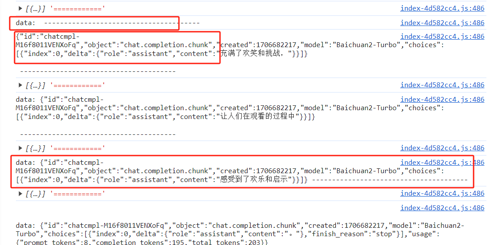

# fetch获取流式数据相关
> 最近有对接类似于chartGPT回答问题的接口，踩坑记录

### 获取数据方式不同
fetch请求不同于XMLHttpRequest请求，是一种新的请求方式，返回的数据为Stream数据，返回结果后需要使用方法获取数据</br>
   response.text() -- 得到文本字符串</br>
   response.json() -- 得到 json 对象</br>
   response.blob() -- 得到二进制 blob 对象</br>
   response.formData() -- 得到 fromData 表单对象</br>
   response.arrayBuffer() -- 得到二进制 arrayBuffer 对象</br>
   response.getReader() -- 得到二进制 BufferReader 对象</br>
```js
fetch("yourUrl",{
    body: JSON.stringify(params)
}).then(res=>{
    return res.Text()
})
```
### 抛出错误的方式不同
fetch请求只要获得响应不会抛出错误，可以使用response.ok判断是否请求成功，返回boolean值，200-299返回true。
```tsx
fetch("yourUrl",{
    body: JSON.stringify(params)
}).then(res=>{
    return res.body.Text()
}).catch(err => {
// 只要获得响应就不会抛出错误  
})
```
 
### fetch返回数据方式不同
接口返回的数据有两种情况，一种是所有的数据收到再统一接收，一种是流式数据，获得字符串为切片数据，会有被截断的情况，需要进行数据的容错处理，而使用postMan得到的数据是处理好的每一条都是正常的切片，所以很容易有自己请求是不是那里没写对错觉
> 流式数据响应头 respose Header中会有</br>
> 

### 处理流式数据
我们先看看流式数据是什么样的

```tsx
// 发送请求
const postMsg = async (data: any) => {
    const res = await fetch("yourUrl", {
        method: "POST",
        headers: {"Content-Type": "application/json",
        },
        body: JSON.stringify(data),
    });
    if (res.status && res.status !== 200){
        return false;
    }
    return res?.body?.getReader();
};

// 正如上图，流式数据会有被截断的情况，需要做一些容错处理
const chunkRef = useRef()
const handleChunkData = (chunk: string) => {
   chunk = chunk.trim();
   // 如果存在上一个切片
   if (chunkRef.current) {
      chunk = chunkRef.current + chunk;
      chunkRef.current = "";
   }

   // 如果存在done,认为是完整切片且是最后一个切片
   if (chunk.includes("[DONE]")) {
      return chunk;
   }

   // 最后一个字符串不为}，则默认切片不完整，保存与下次拼接使用（这种方法不严谨，但已经能解决大部分场景的问题）
   if (chunk[chunk.length - 1] !== "}") {
      chunkRef.current = chunk;
   }
   return chunk;
}

//发送请求，分批处理
const getDate = async() => {
    const res = await postMsg(params)
    const decoder = new TextDecoder();
    while(1){
        const {done, value} = await res.read()
        if(done){
           return
        }
        // 拿到当前切片的数据
        const text = decoder.decode(value);
        // 处理切片数据
        const chunk = handleChunkData(text)
        // 判断是否有不完整切片，如果有，合并下一次处理，没有则获取数据
        if(chunkRef.current) continue;
        // 获取可用数据
        const data = JSON.parse(chunk)
        // 你的业务...    
    }
    
    
    // 或者你也可以这么写,MDN官网写法
    // 参考网址 https://developer.mozilla.org/zh-CN/docs/Web/API/Streams_API/Using_readable_streams
   res.read().then(function processText({done, value}) {
      if (done) {
         //  结束递归
         console.log("Stream complete");
         return;
      }

      // 处理你的value

      // 递归调用
      return reader.read().then(processText);
   });
}
```
### 部署注意事项
开发完本以为万事大吉，线上却出现问题，项目部署在nginx web服务器上，需要把默认开启的缓存关掉，否则nginx代理会因为http缓存等待数据返回再统一返回给客户端，使用流式数据的目的就达不到，需要添加配置（有条件可以考虑fetch流式请求单独走一个代理，避免关闭缓存后对其他大数据量的请求造成的影响）
> proxy_buffering off; <br/>
proxy_http_version 1.1; <br/>
proxy_set_header Connection ""; <br/>

以上就是使用fetch获取流式数据应当注意的一些事项。